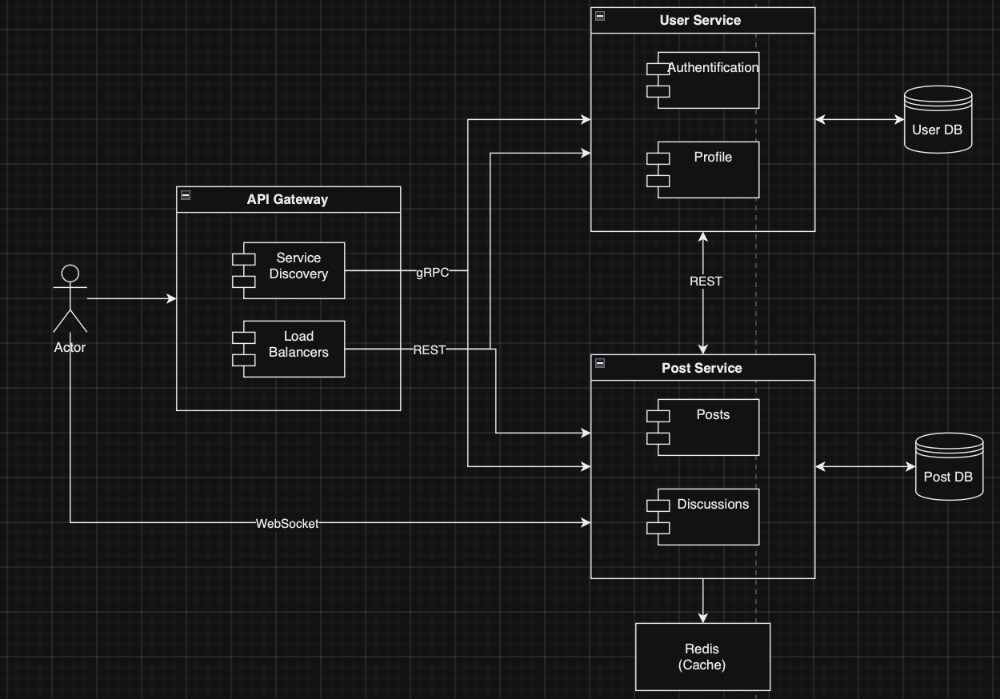

# Car recommendations and discussions platform

## Runnind and Deploying the project
In order to run the project, it is necessary to have installed and running Docker application.

After that it is necessary to run the following commands:
```
docker-compose build
docker-compose up
```
**Troubleshooting:**

Below are presented the commands which can help if any port is occupied:

``` sudo lsof -i -P -n | grep <PORT> ```

``` sudo kill -9 <PID> ```

## Application Suitability:

A platform where users can share car recommendations, reviews, and engage in discussions about different models, maintenance, and news is a good choise for microservices usage because the functionality can be separated and work independently. It can also have features for subscribing to car-related topics or participating in group discussions about specific car models or maintenance tips.

### Suitability for microservices:

Car discussions and recommendations are highly user-driven, and traffic might increase unpredictably. Microservices make it easier to scale different components independently. Each core feature (user authentication, recommendation and discussion platform) can function independently. 

### Real-world Examples: 
Similar platforms, like Reddit, use microservices for independent features like user authentication, content recommendation, and message systems. Netflix also uses microservices for scalable content delivery and personalization features.

## Service Boundaries: 

#### User Service: 
* Manages user registration, authentication, and profiles.

#### Recommendation / Discussion Service: 
* Manages car recommendations, posts, and comments.
* Supports WebSocket for real-time discussions.
#### API Gateway: 
* Central entry point for external clients.
* Routes requests to services based on the API paths.
#### Load Balancers:
* Distribute traffic across multiple instances of each service.
#### gRPC Communication:
* Used for internal communication between services and Service discovery.

### System Architecture Diagram:


## Technology Stack and Communication Patterns: 

### Service 1: User Service (Python)

Handles user registration, authentication, and profile management.

>#### Framework: 
>FastAPI (for building APIs with Python.)
>#### Database: 
>PostgreSQL
>#### Authentication: 
>JWT (JSON Web Tokens)
>#### ORM: 
>SQLAlchemy

### Service 2: Recommendations and Discussions Service (Python)

Manages car recommendations and real-time discussions between users.

>#### Framework:
>FastAPI (Python) for handling recommendations (RESTful API).
>
>FastAPI WebSocket (Python) for managing real-time discussions using WebSocket.
>#### Database:
>PostgreSQL
>
>Redis: For managing WebSocket sessions in real-time discussions.

### API Gateway
>Framework: Express.js (Node.js)

### Communication Patterns
>#### RESTful APIs:
>Used for HTTP communication between external clients and services.
>#### gRPC:
>For efficient communication between services and service discovery.
>#### WebSocket:
>For real-time, bi-directional communication in the Discussions Service.

## Data Management Design
### User Service:
#### Endpoints:

1. ```POST /api/users/register``` - Register a new user.

##### Data:
```json
{
  "name": "string",
  "email": "string",
  "password": "string"
}
```
##### Response:
```json
{
    "name": "string",
    "email": "string",
    "id": "int"
}
```

2. ```POST /api/users/login``` - Authenticate user and issue JWT.

##### Data:
```json
{
  "email": "string",
  "password": "string"
}
```
##### Response:
```json
{
  "token": "string"
}
```

3. ```GET /api/users/me``` - Get authenticated user's profile.

##### Response:
```json
{
  "name": "string",
  "email": "string",
  "id": "int"
}
```

4. ```PUT /api/users/me``` - Update the authenticated user's profile.
##### Data:
```json
{
  "name": "string",
  "bio": "string",
  "avatar_url": "string"
}
```
##### Response:
```json
{
  "message": "Profile updated successfully."
}
```

5. ```GET /api/users/{user_id}``` - Get a user's profile by user ID.
##### Response:
```json
{
  "name": "string",
  "email": "string",
  "id": "int"
}
```
### Recommendation/Discussion Service:
#### Endpoints:

1. ```POST /api/posts``` - Create a new car recommendation post.
##### Data:
```json
{
  "user_id": "int",
  "title": "string",
  "content": "string",
  "car_model": "string"
}
```
##### Response:
```json
{
    "id": "int",
    "title": "string",
    "content": "string",
    "car_model": "string",
    "user_id": "int",
    "comments": []
}
```

2. ```GET /api/posts``` - Retrieve all car recommendations.
##### Response:
```json
[
  {
    "id": "int",
    "car_model": "string",
    "user_id": "int",
    "content": "string",
    "title": "string"
  }
]
```

3. ```GET /api/posts/{post_id}``` - Retrieve a specific post by ID.
##### Response:
```json
{
    "id": "int",
    "title": "string",
    "content": "string",
    "car_model": "string",
    "user_id": "int",
    "comments": []
}
```

4. ```PUT /api/posts/{post_id}``` - Update a specific post by ID.
##### Data:
```json
{
  "title": "string",
  "content": "string",
  "car_model": "string",
  "user_id": "int"
}
```
##### Response:
```json
{
  "message": "Post updated successfully."
}
```

5. ```DELETE /api/posts/{post_id}``` - Delete a specific post by ID.
##### Response:
```json
{
  "message": "Post deleted successfully."
}
```

6. ```WebSocket ws://localhost:3000/ws/api/comments``` - Real-time updates for comments on a post.
##### Data:
```json
{
  "content": "string",
  "user_id": "int"
}
```

## Deployment and Scaling
#### Containerization: 
Usage of Docker.
#### Orchestration: 
Docker Compose to manage deployment, scale services based on traffic, and ensure high availability.
